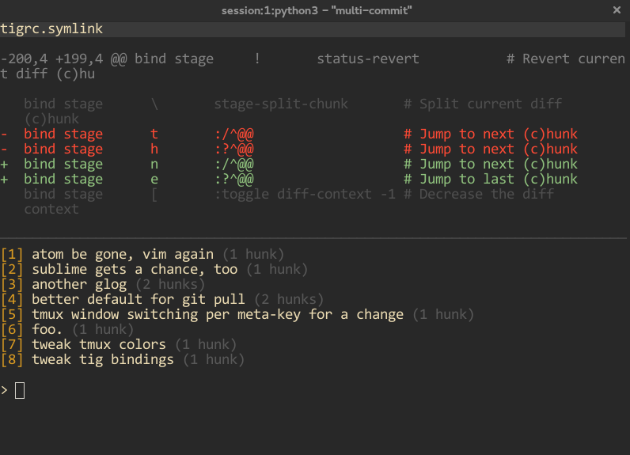
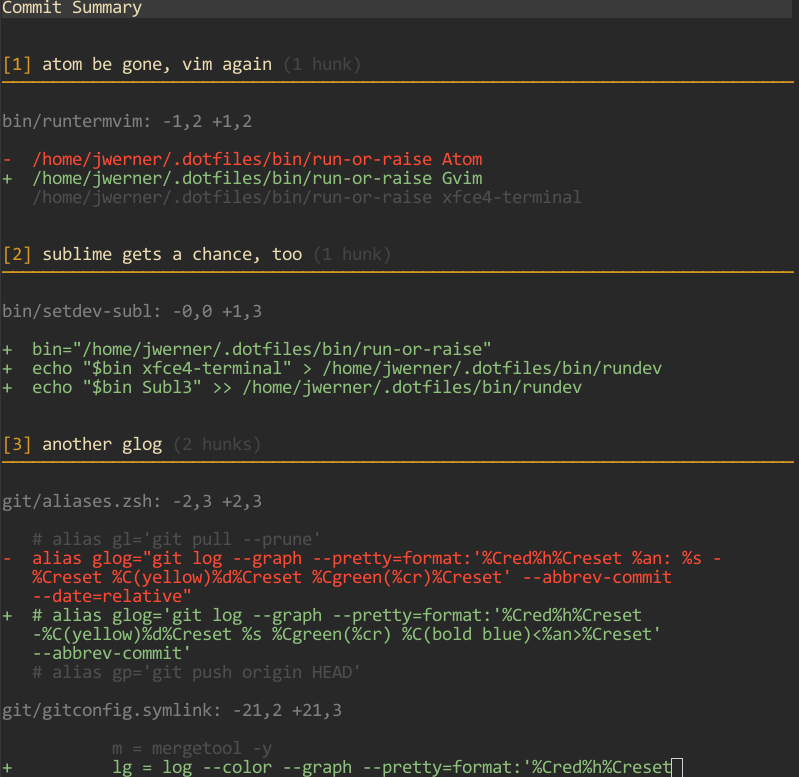

# multi-commit

this is a python tool that allows you to stage hunks in a new way:
you can assign them to multiple future commits on the fly. that way you can just browse through them once and be done, plus you have finegrained commits with minimal effort.

### how to
you will be presented with one hunk and a prompt. input a fitting commit message or a number for a previous commit message (there is a numbered list of the previously entered commit messages above the prompt). enter 'q' to abort. press enter to skip. rinse and repeat for all hunks.

in the end you will be presented with a summary of the future changes and a prompt if you would like to commit all those commits that you just 'planned'.

### missing:
 - splitting hunks

## screens

